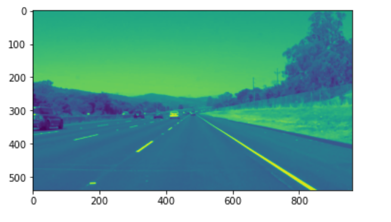
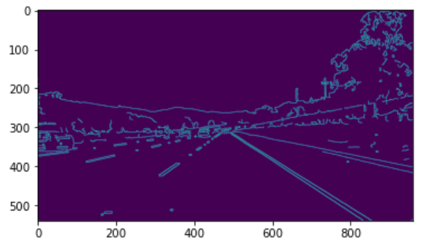
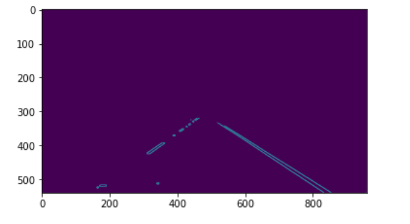

# **Finding Lane Lines on the Road** 

Overview
---

In this project, I wrote code to identify lane lines on the road, using python and open-cv first used an image, and later in a video stream  To complete this project I used all the tools I learned about in the lesson, and built upon them.

#Pipeline
---
My pipeline consisted of following  steps. 
#Step1, Converted Image to Grayscale

#step2
Applied Gaussian smoothing and canny transform to detect the edges

#step 3 Created image mask to select the region of interest

#step4 genrated hough lines and applied on the image

#step5
Finally tested complete pipeline on video stream

To draw a single line on the left and right lanes, modified draw_lines() function and used slope of line formula ((y2-y1)/(x2-x1)) to decide which segments are part of the left line vs. the right line. Then averaged the position of each of the lines and extrapolated to the top and bottom of the lane.

# 2. shortcomings with current pipeline

One potential shortcoming would be what would happen when lines are hit by dark spots , hidden by some object, or dont have lane yet marked. 

Another shortcoming could be if lane line  get out of the region of interest during lane change or pulling off the road.

# 3. Possible improvements to current pipeline

A possible improvement would be to use the HSV color space to deal with shadows.

Another potential improvement could be to use machine learning to identify lane lines.